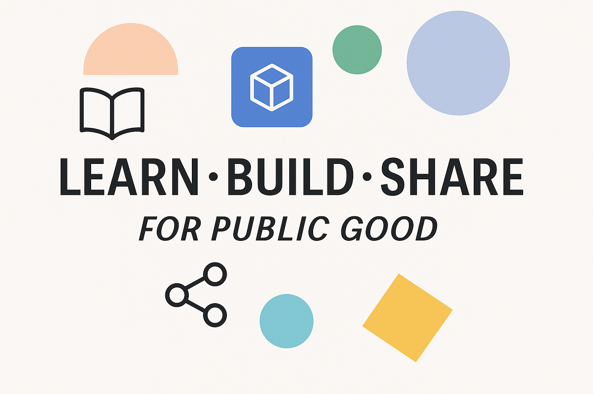

<!DOCTYPE html>
<html lang="en">
<body>

  <!-- Banner -->
  

    
  

  <!-- Top section -->
  <h1 align="center">Hi, I'm Bandhu 👋</h1>

  

    Accountant turned data strategist and AI builder. I create practical tools for public good that help people
    understand systems, use data well and experiment safely with AI. Open knowledge by default.
  

  

    <a href="https://github.com/ibpdas?tab=repositories">Repositories</a> ·
    <a href="https://www.linkedin.com/in/ibpdas/">LinkedIn</a>
  

  

  <!-- Mission and identity -->
  <h2>🌍 Mission and identity</h2>

  

    
    
    
    
    
  

  

  <!-- About me -->
  <h2>👤 About me</h2>

  

    I work at the intersection of data, policy and technology in the UK public sector.
    My background spans finance, data science and data strategy.
  

  
My focus areas include:

  <ul>
    <li>Designing practical and context aware data strategies</li>
    <li>Exploring data to support evidence based decisions</li>
    <li>Building AI agents and analytical tools that are simple and useful</li>
    <li>Supporting safe and confident experimentation with emerging technologies</li>
  </ul>

  

    I enjoy combining strategic thinking with hands on building.
    My style is modular, iterative, collaborative and action oriented.
  

  

## 🔍 Featured Work

Projects at different stages of maturity, from concept to complete builds.

---

### 🟩 ValueLine: Data Strategy Impact Dashboard  

A practical dashboard for federated organisations to create a clear line of sight from data foundations to maturity and outcomes.  
**Tech:** HTML · CSS · JavaScript

---

### 🔷 ThinkStudio: Data Strategy Accelerator  

A learning and facilitation tool to help public sector teams diagnose their context and turn insights into actionable data strategy shifts.  
**Tech:** Python · Streamlit · Plotly

---

### ⚪ PublicDataChain: Provenance Ledger  

A Web3 prototype that demonstrates tamper evident provenance for public datasets using decentralised verification and open lineage.  
**Tech:** Solidity · Hardhat · Next.js · wagmi · viem

---

### 🟩 MacroCycle: AI Business Cycle Agent  

A multi-agent experiment for detecting macroeconomic business cycles using USA datasets.  
**Tech:** Python · Plotly · Streamlit

---

### 🟧 EnViro: Environmental Insight Agent  

An AI agent that helps analysts explore environmental and agricultural data and curate trusted sources.  
**Tech:** APIs · AI Agents · Streamlit

  <!-- Tech and tools -->
  <h2>🛠️ Tech and tools</h2>

  

    
    
    
    
    
     
    
    
    
    
     
    
    
    
     
    
    
  

  

  <!-- AI principles -->
  <h2>🤖 How I use AI</h2>

  

    My AI journey began with a nine month AI Policy Fellowship at Imperial College London.
    I now treat AI tools like multidisciplinary collaborators that support thinking, exploration and delivery.
  

  

    My work focuses on responsible and production ready AI workflows. I care about how assumptions are made,
    how models behave and how people understand them.
  

  
My principles:

  <ul>
    <li>Human led oversight</li>
    <li>Provenance and transparency</li>
    <li>Clarity of assumptions</li>
    <li>Safe experimentation</li>
    <li>Value over complexity</li>
    <li>Public good</li>
  </ul>

  

  <!-- Collaboration -->
  <h2>🤝 Collaboration</h2>

  
I enjoy working with:

  <ul>
    <li>Public sector teams who want clear and practical data roadmaps</li>
    <li>Analysts who want to communicate evidence with clarity</li>
    <li>Builders exploring AI agents, explainability and data provenance</li>
  </ul>

  

    If you want to collaborate you are welcome to open an issue or connect on
    <a href="https://www.linkedin.com/in/ibpdas/">LinkedIn</a>.
  

  

  <!-- Footer -->
  

    All views are personal. Projects here are side experiments created for learning and public good.
  

</body>
</html>